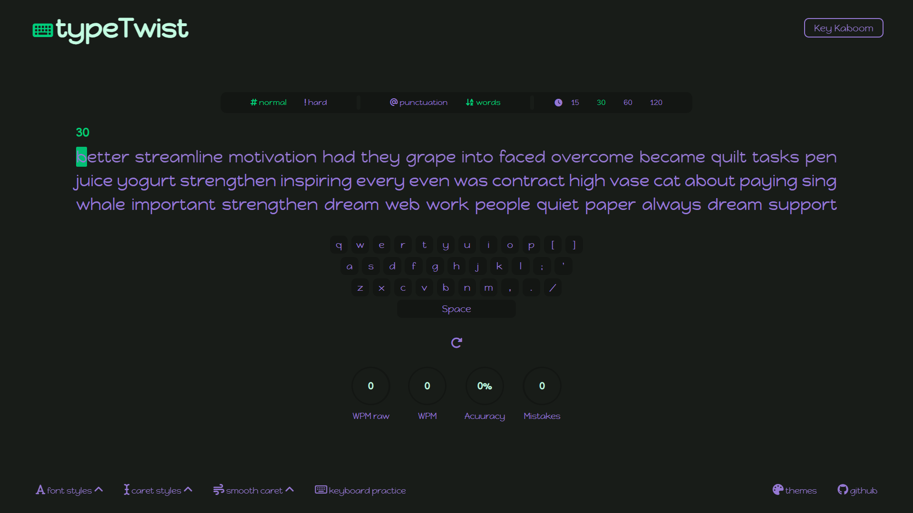

# typeTwist (Website)

A website that provides typing tests, practice keyboard and typing challenges.

## First glance

|  | 
|      :--------:       | 
|    typeTwist        |   

## Typing Test 

- Normal and Hard difficulty levels for words
- Punctuation and normal words
- Test time options

## App lock look

|  |  |         
|    :--------:       | :-------:  |
|    Light theme      | Dark theme |

## Tech stack

- Android Studio
- Kotlin
- Room Database
- MVVM Architecture Pattern
### Note:

The **Utilities** package contains kotlin file **SendMail**. This is used to send mail to the user for verification. It contains two variables :

- **stringSenderEmail** : Should contain the email id through which the emails should be sent for verification.
- **stringPasswordSenderEmail** : Should contain the password for the sender's email. This should not be your sender's email password, instead, it should be the "App password" generated for your sender's email using two factor authentication option of the email.

Specify these variables as per your choice before using the project to avoid any errors.

